# ■ PJT-FINAL-D-KSY-KYK

> 프로젝트 공통 README

## 프로젝트 개요

### SSAFY 1학기 최종 프로젝트

<br>

### ✔팀원 구성 및 역할 분담

<table align="center">
    <tr align="center">
        <td style="min-width: 220px;">
            <a href="https://github.com/sunyoung315">
              
              <br />
              <b>김선영(팀장) </b>
            </a>
        </td>         
        <td style="min-width: 220px;">
            <a href="https://github.com/yukyung531">
              
              <br />
              <b>권유경</b>
            </a> 
        </td>
      </tr>
    <tr align="left">
        <td>       
        [Back-end & Front-end]<br>
            • DB 모델링<br>
            • vue3-apexcharts 활용(체중 변동 조회 기능)<br>
            • DTO, Controller, Service, DAO, Mapper 구현 <br>
              &nbsp; &nbsp;(exercise,user 관련 기능)<br> 
            • 로그인 기능 구현<br>
            • 운동 검색 기능 구현(csv파일 활용)<br>
            • 운동 등록, 조회, 수정, 삭제 기능 구현<br>
         	• 라우터 설계 및 기본 틀 잡기<br/>
            • 폰트 및 부트스트랩 적용<br>
            • 운동 관련 유효성 검사 기능<br>
            • 로고 및 파비콘 제작<br>
            • 설계 예상 피그마 제작<br>
            • css 적용<br>
    	</td>
   		<td> 
          [Back-end & Front-end]<br>
            • DB 모델링<br>
            • 영양 성분 API 활용(음식 검색 기능 구현)<br>
            • v-calendar 활용(일주일 간 기록 조회 기능 구현)<br>
            • DTO, Controller, Service, DAO, Mapper 구현<br>
              &nbsp; &nbsp;(weight, diet 관련 기능)<br>  
            • 파일 업로드 기능 구현<br>
            • 요구서 및 README 작성<br/>
            • 식단 등록, 조회, 수정, 삭제 기능 구현<br>
            • 식단 및 회원가입 관련 유효성 검사 기능<br>
            • css 적용<br>
        </td>       
	</tr>
</table>

<br/>

### ✔프로젝트 요구사항

- 기존 진행한 관통 프로젝트의 요구사항을 정리하고 페어 별로 프로젝트에 적용할 아이디어를 추가하여 Final Project를 완성한다. 
- SpringBoot와 MyBatis연동을 활용한 RestAPI 서버 구현 
- Vue3버전을 활용한 SPA 클라이언트 구현

<br>

### ✔프로젝트 목표

- 웹 아키텍처를 이해하고 이를 활용하여 웹 프로젝트를 설계하고 구현할 수 있다.
- SpringBoot와 Vue를 이해하고 활용할 수 있다.
- Rest API와 VueRouter을 활용하여 SPA 방식으로 프로젝트를 구성할 수 있다. 
- 기존 관통 프로젝트에 새로운 아이디어를 추가하여 과정에서 배운 기술들을 다양하게 구현해 본다.

<br>

<div><h3>📚 STACKS</h3></div> 
<div align=center> 
   
   
   
  
  <br>
   
   
   
  <br>
 
 
 
 
</div>
​    


<br><br>

### ✔UI 설계

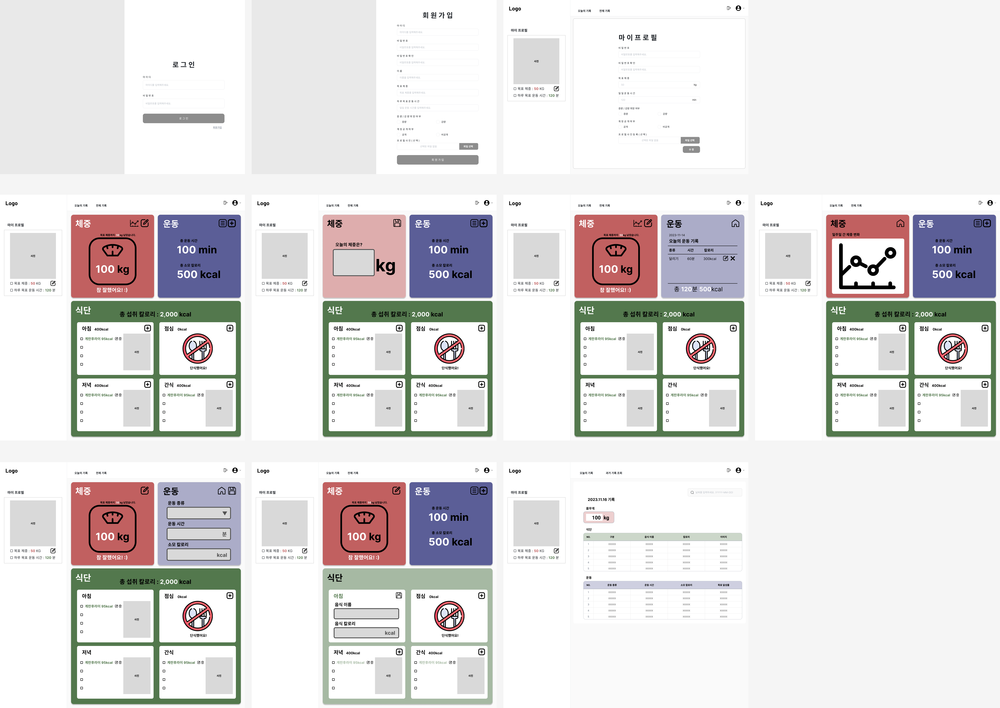

<br><br>

### ✔ERD (Entity-Relationship Digram)

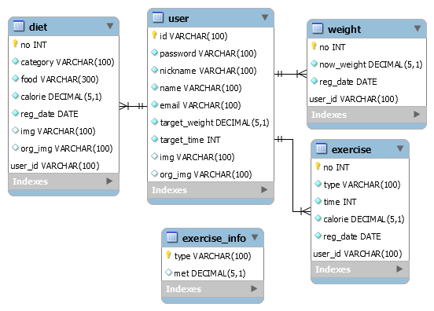

<br><br>

### ✔요구사항 명세서

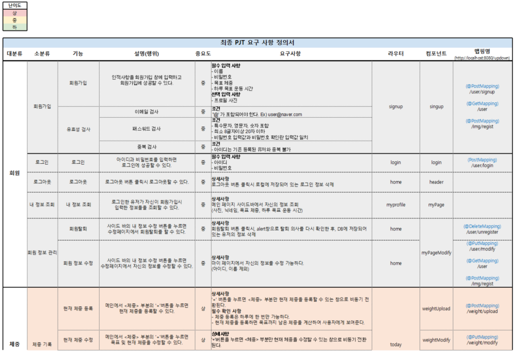

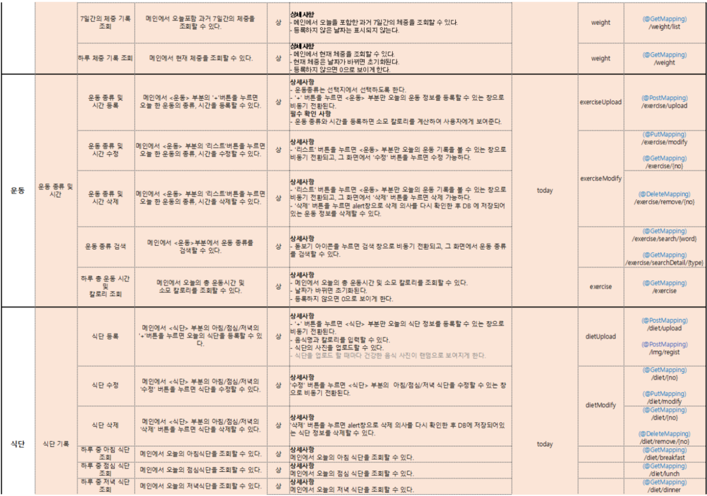


<br><br>

### ✔URL

|     URL 패턴     |         역할         |
| :--------------: | :------------------: |
|      /user       | 전체 사용자 가져오기 |
|   /user/login    |     로그인 기능      |
|   /user/signup   |    회원가입 기능     |
|   /user/modify   | 개인 정보 수정 기능  |
| /user/unregister |    회원 탈퇴 기능    |

|    URL 패턴    |          역할          |
| :------------: | :--------------------: |
|    /weight     |  당일 체중 조회 기능   |
| /weight/upload |     체중 등록 기능     |
| /weight/modify |     체중 수정 기능     |
|  /weight/list  | 7일간의 체중 기록 조회 |

|        URL 패턴         |                         역할                         |
| :---------------------: | :--------------------------------------------------: |
|        /exercise        |           특정 날짜의 전체 운동 기록 조회            |
|     /exercise/{no}      |               운동 기록 한 개 가져오기               |
|    /exercise/modify     |                선택한 운동 기록 수정                 |
|  /exercise/remove/{no}  |                선택한 운동 기록 삭제                 |
| /exercise/search/{word} | 입력한 키워드를 포함하는 운동명의 운동 정보 가져오기 |
| /exercise/search/{type} |          운동명이 동일한 운동 정보 가져오기          |

|     URL 패턴      |            역할             |
| :---------------: | :-------------------------: |
|       /diet       |     하루 식단 기록 조회     |
|   /diet/upload    |       식단 등록 기능        |
|   /diet/modify    |    선택한 식단 기록 수정    |
| /diet/remove/{no} |    선택한 식단 기록 삭제    |
|  /diet/breakfast  | 하루 중 아침 식단 기록 조회 |
|    /diet/lunch    | 하루 중 점심 식단 기록 조회 |
|   /diet/dinner    | 하루 중 저녁 식단 기록 조회 |
|    /diet/snack    | 하루 중 간식 식단 기록 조회 |
|    /diet/{no}     |     식단 하나 가져오기      |

|  URL 패턴   |       역할       |
| :---------: | :--------------: |
| /img/regist | 파일 업로드 기능 |

<br>

---

<br>

### ✔폴더 구조

##### 📂 SpringBoot 폴더 구조

```
📂 SSAFIT
   ㄴ 📂 src/main/java
       ㄴ 📂 com.ssafy.updown
          ㄴ 📂 config
             ㄴ 📄 DBConfig.java
             ㄴ 📄 SwaggerConfig.java
             ㄴ 📄 WebConfig.java
          ㄴ 📂 controller
             ㄴ 📄 DietController.java
             ㄴ 📄 ExerciseController.java
             ㄴ 📄 FileController.java
             ㄴ 📄 UserController.java
             ㄴ 📄 WeightController.java
          ㄴ 📂 model   
              ㄴ 📂 dao
                 ㄴ 📄 DietDao.java
                 ㄴ 📄 ExerciseDao.java
                 ㄴ 📄 UserDao.java
                 ㄴ 📄 Weight.java
              ㄴ 📂 dto
                 ㄴ 📄 Diet.java
                 ㄴ 📄 Exercise.java
                 ㄴ 📄 ExerciseInfo.java       
                 ㄴ 📄 Img.java
                 ㄴ 📄 User.java
                 ㄴ 📄 Weight.java  
              ㄴ 📂 service
                 ㄴ 📄 DietService.java
                 ㄴ 📄 DietServiceDaoImpl.java      
                 ㄴ 📄 ExerciseService.java
                 ㄴ 📄 ExerciseServiceDaoImpl.java
                 ㄴ 📄 UserService.java
                 ㄴ 📄 UserServiceImpl.java
                 ㄴ 📄 WeightService.java
                 ㄴ 📄 WeightServiceImpl.java
   ㄴ 📂 src/main/resource
      ㄴ 📂 mappers
         ㄴ 📄 DietMapper.xml
         ㄴ 📄 ExerciseMapper.xml
         ㄴ 📄 UserMapper.xml         
         ㄴ 📄 WeightMapper.xml
      ㄴ 🌿 application.properties
   ㄴ 📄 pom.xml 
```

<br/>

##### 📂Vue 폴더 구조

```
📂 UPDOWN-VUE
   ㄴ 📂 src
       ㄴ 📂 asset
         ㄴ 📂 bootstrap-icon
         ㄴ 📂 image          
       ㄴ 📂 components
       	 ㄴ 📂 common
       	   ㄴ 🔹 TheAside.vue
       	   ㄴ 🔹 TheFooter.vue
       	   ㄴ 🔹 TheHeader.vue
         ㄴ 📂 diet  
           ㄴ 🔹 DietBreakFast.vue
           ㄴ 🔹 DietLunch.vue
           ㄴ 🔹 DietDinner.vue
           ㄴ 🔹 DietSnack.vue
           ㄴ 🔹 DietDetail.vue
           ㄴ 🔹 DietModify.vue
           ㄴ 🔹 DietUpload.vue
           ㄴ 🔹 DietSearch.vue
           ㄴ 🔹 DietView.vue           
         ㄴ 📂 exercise
           ㄴ 🔹 ExerciseDetail.vue
           ㄴ 🔹 ExerciseModify.vue
           ㄴ 🔹 ExerciseUpload.vue
           ㄴ 🔹 ExerciseSearch.vue
           ㄴ 🔹 ExerciseList.vue
           ㄴ 🔹 ExerciseView.vue   
         ㄴ 📂 record
           ㄴ 🔹 RecordDiet.vue
           ㄴ 🔹 RecordExercise.vue
           ㄴ 🔹 RecordWeight.vue 
         ㄴ 📂 user
           ㄴ 🔹 Login.vue
           ㄴ 🔹 MyProfile.vue
           ㄴ 🔹 MyprofileModify.vue 
         ㄴ 📂 weight  
           ㄴ 🔹 WeightDetail.vue
           ㄴ 🔹 WeightModify.vue
           ㄴ 🔹 WeightUpload.vue
           ㄴ 🔹 WeightGraph.vue
           ㄴ 🔹 WeightView.vue 
       ㄴ 📂 router
       	   ㄴ 🔸 index.js
       ㄴ 📂 stores
           ㄴ 🔸 diet.js
           ㄴ 🔸 exercise.js
           ㄴ 🔸 user.js
           ㄴ 🔸 weight.js
       ㄴ 📂 views
           ㄴ 🔹 HomeView.vue
           ㄴ 🔹 MyProfileView.vue
           ㄴ 🔹 RecordView.vue
           ㄴ 🔹 StartView.vue
           ㄴ 🔹 TodayView.vue
       ㄴ 🔹 App.vue
       ㄴ 🔸 main.js          
```

<br/>

#### 💻 주요 코드

##### 1. 파일 업로드

**[Back-end]**

📌 <u>**WebConfig.java**</u> 

```java
package com.ssafy.updown.config;

import org.springframework.context.annotation.Configuration;
import org.springframework.web.servlet.config.annotation.CorsRegistry;
import org.springframework.web.servlet.config.annotation.EnableWebMvc;
import org.springframework.web.servlet.config.annotation.ResourceHandlerRegistry;
import org.springframework.web.servlet.config.annotation.WebMvcConfigurer;

@Configuration
@EnableWebMvc
public class WebConfig implements WebMvcConfigurer {
 
    	...

	 @Override
	    public void addResourceHandlers(ResourceHandlerRegistry registry) {
	        registry 
                //  웹 서버가 서비스하는 정적 리소스의 경로를 설정
	            .addResourceHandler("/upload/**") // '/upload/'로 시작하는 모든 URL 패턴을 처리하는 핸들러를 추가
	            .addResourceLocations("file:/C:/upload/"); // 실제 파일이 위치하는 경로를 지정
	    }
}

```

- 위 코드는 서버가 시작될 때 웹 MVC 설정을 하는 과정에서 적용

- 클라이언트가 '/upload/'로 요청을 보내면, 실제로는 'C:/upload/' 경로에서 해당 파일을 찾게 된다.

  이렇게 설정함으로써 클라이언트는 직접 파일 시스템에 접근하지 않고도 필요한 파일을 가져올 수 있다.

  즉 클라이언트가 '/upload/' URL로 요청을 보낼 경우, 서버의 'C:/upload/' 디렉토리에서 해당 파일을 찾아 반환하도록 한다.

<br>

📌 <u>**application.properties**</u> 

```apl
	...

#upload file size
spring.servlet.multipart.maxFileSize=10MB  #한 번에 업로드 할 수 있는 각 파일의 최대 크기 지정
spring.servlet.multipart.maxRequestSize=10MB  #한 번의 요청으로 업로드할 수 있는 전체 파일의 최대 크기 지정

#정적 리소스에 대한 설정
spring.mvc.static-path-pattern=/upload/**  #요청 URL의 패턴을 지정
spring.web.resources.static-locations=file:/C:/upload/  #해당 패턴에 매칭되는 요청이 올 경우 서빙할 정적 리소스의 위치를 지정하는 설정

```

- 위 코드는 서버가 동작하는 도중에 필요한 세부 설정을 담당

- 클라이언트가 '/upload/'로 시작하는 URL로 요청을 보내면, 서버는 'C:/upload/' 위치에서 해당 파일을 찾아 반환하도록 한다.

  이렇게 설정하면 클라이언트는 서버의 파일 시스템에 직접 접근하지 않고도 필요한 파일을 가져올 수 있다.

<br>

📌 <u>**Img.java**</u> 

```java
package com.ssafy.updown.model.dto;
// 이미지 객체
public class Img {
	
	private String img;
	private String orgImg;
	
	public Img() {
	}	
	
	public Img(String img, String orgImg) {
		super();
		this.img = img;
		this.orgImg = orgImg;
	}

	public String getImg() {
		return img;
	}

	public void setImg(String img) {
		this.img = img;
	}

	public String getOrgImg() {
		return orgImg;
	}

	public void setOrgImg(String orgImg) {
		this.orgImg = orgImg;
	}

	@Override
	public String toString() {
		return "Img [img=" + img + ", orgImg=" + orgImg + "]";
	}	
}

```

- 파일을 저장할 DTO

<br>

📌 <u>**FileController.java**</u> 

```java
package com.ssafy.updown.controller;

import java.io.File;
import java.io.IOException;

import org.springframework.beans.factory.annotation.Autowired;
import org.springframework.core.io.Resource;
import org.springframework.core.io.ResourceLoader;
import org.springframework.http.HttpStatus;
import org.springframework.http.MediaType;
import org.springframework.http.ResponseEntity;
import org.springframework.web.bind.annotation.PostMapping;
import org.springframework.web.bind.annotation.RequestMapping;
import org.springframework.web.bind.annotation.RequestPart;
import org.springframework.web.bind.annotation.RestController;
import org.springframework.web.multipart.MultipartFile;

import com.ssafy.updown.model.dto.Img;
import com.ssafy.updown.model.service.UserService;

@RestController
@RequestMapping("/updown")
public class FileController {

	@Autowired
	UserService uService;
	
    // 파일을 저장할 디렉토리 경로
	static File dir = new File("C:/upload");

	// 파일 업로드
    // 요청 본문의 타입이 'multipart/form-data'인 것만 처리
    // Vue에서 formData.append('file', serveyImage.value.files[0]); 'file'이라는 이름으로 저장해서 보냈기 때문에
    // 'file'이라는 이름의 파트에서 파일 정보를 가져옴
	@PostMapping(value = "/img/regist", consumes = { MediaType.MULTIPART_FORM_DATA_VALUE })
	public ResponseEntity imgRegist(@RequestPart(value="file",required = false)MultipartFile file) throws IllegalStateException, IOException {
		
        // img 객체 생성
		Img img = new Img();
		
		//같은 이름의 파일이 여러개 있을 경우를 위해서 업로드한 시간(밀리초단위)를 파일 이름 앞에 추가
        //중복방지 처리가된 파일이름을 img, 원래 파일이름을 orgImg로 한다.
		img.setImg(System.currentTimeMillis() + "_" + file.getOriginalFilename());
		// img 객체에 원본 파일 이름 저장
		img.setOrgImg(file.getOriginalFilename());
		// // 파일 저장
		
		// 디렉토리가 없다면 생성	    
	    if (!dir.exists()) {
	    	dir.mkdirs();
	    }
        
        // 받은 파일을 해당 디렉토리에 저장
		file.transferTo(new File(dir, img.getImg()));
        
		return new ResponseEntity(img, HttpStatus.OK);
	}
}

```

<br>

**[Front-end]**

📌 <u>**SignUp.vue**</u> 

```vue
<template>
    <div class="signup-container">
        <form @submit.prevent="submitForm">
            <div>
                <p class="title">회원가입</p>
                <fieldset>
                    <div class="signup">
                       	...
                    
                        <label>프로필 사진(선택)</label>
                        <div>
                            <input type="file" placeholder="Username" ref="serveyImage">
                        </div>    
                 
                        <input id="gosignup" type="submit" value="회원가입">
                        <div id="signup">
                            <RouterLink to="/">홈으로</RouterLink>
                        </div>
                    </div>
                </fieldset>
            </div>
        </form>

    </div>
</template>

<script setup>
import { ref } from 'vue';
import { useRouter } from 'vue-router';
import axios from 'axios';

const router = useRouter();

// 파일 입력 필드를 참조하는 데 사용
const serveyImage = ref(null);

// 회원가입할 유저
const signupUser = ref({
    id: '',
    password: '',
    nickname: '',
    name: '',
    email: '',
    targetWeight: '',
    targetTime: '',
    updown: '',
    isSecret: '',
    img: '',
    orgImg: ''
})


// 이미지 업로드
const submitForm = async () => {
    // 업로드한 파일이 없다면 바로 회원가입 코드 실행
    if (serveyImage.value.files[0] == null) {
        goSignup();
        return;
    }

    // 업로드한 파일이 있다면 FormDate 객체 생성
    const formData = new FormData();
    // 업로드한 파일을 'file' 이라는 키에 추가
    formData.append('file', serveyImage.value.files[0]);
    
    // Vue.js 코드에서 formData.append() 메소드로 추가한 키와 
    // Spring 코드에서 @RequestPart 어노테이션의 value 속성을 동일하게 맞춰주어야 파일 데이터를 제대로 받아올 수 있음

    axios({
        url: `http://localhost:8080/updown/img/regist`, // 서버로 이미지 파일 전송
        method: 'POST',
        data: formData,
        headers: {
            'Content-Type': 'multipart/form-data'
        },
    }).then((res) => { // 응답으로 받은 이미지 정보를 회원가입할 유저의 img, orgImg 속성 값에 저장
        signupUser.value.img = res.data.img
        signupUser.value.orgImg = res.data.orgImg
    }).then(() => {
        // 이미지 업로드 후 회원가입 코드 실행
        goSignup();
    })
};

...

</script>

<style scoped>
	...
</style>
```

<br>

**2. 공공데이터 API 활용**

📌 <u>**DietSearch.vue**</u> 

```vue
<template>
    <div class="diet-search">
        <div class="diet-head">
            <div class="diet-head-category">{{ props.category }}</div>
            
        </div>
        <div class="diet-search-input">
            <input type="text" placeholder="음식 이름을 검색해주세요." v-model="word" @keyup.enter="search">
            
        </div>
        <table class="table" id="table-head">
            <thead>
                <tr>
                    <th class="diet-type">음식명</th>
                    <th class="diet-met">100g당 열량(kcal)</th>
                </tr>
            </thead>
        </table>
        <div class="search-find" :class="{find : ok}" v-if="searchList==''">검색 결과가 없습니다.</div>
        <div v-else class="box" style="height: 11rem; overflow-y: auto; overflow-x: hidden;">
            <table class="table" id="diet">
                <tbody>
                    <tr id="diet-content" @click="getInfo(info)" class="cursor" v-for="info in searchList" :key="info.type">
                        <td class="diet-type">{{ info.food }}</td>
                        <td class="diet-met">{{ (info.calorie * 100).toFixed(1) }}kcal</td>
                    </tr>
                </tbody>
            </table>
        </div>
    </div>
</template>

<script setup>
import axios from 'axios';
import { ref } from 'vue';

const props = defineProps({
    category: String
})

// 요청할 api url
const API_URL = `http://apis.data.go.kr/1471000/FoodNtrIrdntInfoService1/getFoodNtrItdntList1`

const searchList = ref([]);

const word = ref('');

let ok = ref(false);

const emits = defineEmits(["getInfo", "search", "regist"]);

const getInfo = function (info) {
    searchList.value = [];
    word.value = '';
    emits("getInfo", info);
}

const cancel = function () {
    emits("regist");
}

const search = function () {
    searchList.value = ([]);
    axios.get(API_URL, {
        params: {
            ServiceKey: "s9nr977YLidCuV1NlVpRuFzpmvEqT8y/dHIzz+mh2MnSGTH8uRTydZZbklrRL5wJ960pGV1J46pj6/RrTXXJhQ==",
            desc_kor: word.value,
            type: "json",
        }
    })
    .then((res) => {
        if(!res.data.body.items) {
            ok.value=true;
            setTimeout(function(){
                ok.value=false;
            },3000)
            return;
        }
        const response = res.data.body.items
        for (let i = 0; i < response.length; i++) {
            if(response[i].SERVING_WT == 0) continue;
            searchList.value.push({ 
                food: response[i].DESC_KOR, 
                calorie: (response[i].NUTR_CONT1 / response[i].SERVING_WT).toFixed(1) });
        }
        searchList.value = searchList.value.filter((item, index, self) =>
            index === self.findIndex((t) => (
                t.food === item.food
            ))
        )
    })
}

</script>

<style scoped>
    ...
</style>
```

<br>

**3. CRUD 구현**

📌 <u>**WeightController.java**</u> 

```java
package com.ssafy.updown.controller;

import java.util.List;

import org.apache.ibatis.annotations.Param;
import org.springframework.beans.factory.annotation.Autowired;
import org.springframework.http.HttpStatus;
import org.springframework.http.ResponseEntity;
import org.springframework.web.bind.annotation.GetMapping;
import org.springframework.web.bind.annotation.PostMapping;
import org.springframework.web.bind.annotation.PutMapping;
import org.springframework.web.bind.annotation.RequestBody;
import org.springframework.web.bind.annotation.RequestMapping;
import org.springframework.web.bind.annotation.RestController;

import com.ssafy.updown.model.dto.Weight;
import com.ssafy.updown.model.service.WeightService;


@RestController
@RequestMapping("/updown")
public class WeightController {

	@Autowired
	private WeightService weightService;

	// 체중 등록
	@PostMapping("/weight/upload")
	public ResponseEntity<Void> uploadWeight(@RequestBody Weight weight) {
		weightService.uploadWeight(weight);
		return new ResponseEntity<Void>(HttpStatus.CREATED);
	}

	// 체중 수정
	@PutMapping("/weight/modify")
	public ResponseEntity<?> modifyWeight(@RequestBody Weight weight) {
		if (weightService.modifyWeight(weight))
			return new ResponseEntity<Weight>(weight, HttpStatus.OK);
		return new ResponseEntity<Void>(HttpStatus.BAD_REQUEST);
	}

	// 하루 체중 기록 조회
	@GetMapping("/weight")
	public ResponseEntity<?> detailWeight(@Param("loginUserId") String loginUserId, @Param("regDate") String regDate) {
		Weight weight =  weightService.getWeight(loginUserId, regDate);
		return new ResponseEntity<Weight>(weight, HttpStatus.OK);		
	}
	
	//7일간의 체중 기록 초죄
	@GetMapping("/weight/list")
	public ResponseEntity<List<Weight>> getWeightList(String loginUserId) {
		List<Weight> wList = weightService.getWeightList(loginUserId);
		return new ResponseEntity<List<Weight>>(wList, HttpStatus.OK);
	}
	

}

```

<br>

📌 <u>**WeightMapper.xml**</u> 

```xml
<?xml version="1.0" encoding="UTF-8"?>
<!DOCTYPE mapper
  PUBLIC "-//mybatis.org//DTD Mapper 3.0//EN"
  "https://mybatis.org/dtd/mybatis-3-mapper.dtd">
<mapper namespace="com.ssafy.updown.model.dao.WeightDao">

	<!-- 체중 등록 -->
	<insert id="insertWeight" parameterType="Weight">
		INSERT INTO weight (now_weight, reg_date, user_id)
		VALUES(#{nowWeight}, date_format(now(), '%Y-%m-%d'), #{userId} )
	</insert>
	
	<!-- 체중 수정 -->
	<update id="updateWeight" parameterType="Weight">
		UPDATE weight
		SET now_weight=#{nowWeight}
		WHERE reg_date = #{regDate} AND user_id = #{userId}
	</update>
	
	<!-- 당일 체중 조회 -->
	<select id="selectWeight" parameterType="map" resultType="Weight">
		SELECT no, now_weight as nowWeight, reg_date as regDate, user_id as userId
		FROM weight
		WHERE user_id = #{loginUserId} AND reg_date = #{regDate}
	</select>
	
	<!-- 7일간의 체중 기록 조회 -->
	<select id="selectWeightList" parameterType="String" resultType="Weight">
		SELECT no, now_weight as nowWeight, date_format(reg_date, '%m/%d') as regDate, user_id as userId
		FROM weight
		WHERE user_id = #{loginUserId} AND reg_date BETWEEN date_format(DATE_ADD(now(), INTERVAL -6 DAY), 
        '%Y-%m-%d') AND date_format(now(), '%Y-%m-%d');
	</select>
</mapper>
```

<br>

📌 <u>**DietController.java**</u> 

```java
package com.ssafy.updown.controller;

import java.util.List;

import org.springframework.beans.factory.annotation.Autowired;
import org.springframework.http.HttpStatus;
import org.springframework.http.ResponseEntity;
import org.springframework.web.bind.annotation.DeleteMapping;
import org.springframework.web.bind.annotation.GetMapping;
import org.springframework.web.bind.annotation.PathVariable;
import org.springframework.web.bind.annotation.PostMapping;
import org.springframework.web.bind.annotation.PutMapping;
import org.springframework.web.bind.annotation.RequestBody;
import org.springframework.web.bind.annotation.RequestMapping;
import org.springframework.web.bind.annotation.RestController;

import com.ssafy.updown.model.dto.Diet;
import com.ssafy.updown.model.service.DietService;


@RestController
@RequestMapping("/updown")
public class DietController {

	@Autowired
	DietService dietService;

	// 식단 등록
	@PostMapping("/diet/upload")
	public ResponseEntity<Diet> uploadDiet(@RequestBody Diet diet) {
		dietService.uploadDiet(diet);
		return new ResponseEntity<Diet>(diet, HttpStatus.CREATED);
	}

	// 식단 수정
	@PutMapping("/diet/modify")
	public ResponseEntity<?> modifyDiet(@RequestBody Diet diet) {
		// 만약 식단이 잘 수정되었다면
		if (dietService.modifyDiet(diet)) {
			return new ResponseEntity<Diet>(diet, HttpStatus.OK);
		}
		// 식단이 잘 수정되지 않았다면
		return new ResponseEntity<Void>(HttpStatus.BAD_REQUEST);
	}

	// 식단 삭제
	@DeleteMapping("/diet/remove/{no}")
	public ResponseEntity<Void> removeDiet(@PathVariable int no){
		dietService.removeDiet(no);
		return new ResponseEntity<Void>(HttpStatus.OK);		
	}

	// 하루 식단 기록 조회
	@GetMapping("/diet")
	public ResponseEntity<List<Diet>> getDietOneday(String loginUserId, String regDate){
		List<Diet> dietList = dietService.getDietOneday(loginUserId, regDate);
		return new ResponseEntity<List<Diet>>(dietList, HttpStatus.OK);		
	}
	
	// 하루 중 아침 식단 기록 조회
	@GetMapping("/diet/breakfast")
	public ResponseEntity<List<Diet>> getDietOnedayBreakfast(String loginUserId, String regDate){
		List<Diet> dietList = dietService.getDietOnedayBreakfast(loginUserId, regDate);
		return new ResponseEntity<List<Diet>>(dietList, HttpStatus.OK);		
	}
	
	// 하루 중 점심 식단 기록 조회
	@GetMapping("/diet/lunch")
	public ResponseEntity<List<Diet>> getDietOnedayLunch(String loginUserId, String regDate){
		List<Diet> dietList = dietService.getDietOnedayLunch(loginUserId, regDate);
		return new ResponseEntity<List<Diet>>(dietList, HttpStatus.OK);		
	}
	
	// 하루 중 저녁 식단 기록 조회
	@GetMapping("/diet/dinner")
	public ResponseEntity<List<Diet>> getDietOnedayDinner(String loginUserId, String regDate){
		List<Diet> dietList = dietService.getDietOnedayDinner(loginUserId, regDate);
		return new ResponseEntity<List<Diet>>(dietList, HttpStatus.OK);		
	}
	
	// 하루 중 간식 식단 기록 조회
	@GetMapping("/diet/snack")
	public ResponseEntity<List<Diet>> getDietOnedaySnack(String loginUserId, String regDate){
		List<Diet> dietList = dietService.getDietOnedaySnack(loginUserId, regDate);
		return new ResponseEntity<List<Diet>>(dietList, HttpStatus.OK);		
	}
		
	// 식단 하나 조회
	@GetMapping("/diet/{no}")
	public ResponseEntity<Diet> getDietOne(@PathVariable int no){
		Diet diet = dietService.getDietOne(no);
		return new ResponseEntity<Diet>(diet, HttpStatus.OK);
	}

}

```

<br>

📌 <u>**DietMapper.xml**</u> 

```xml
<?xml version="1.0" encoding="UTF-8"?>
<!DOCTYPE mapper
  PUBLIC "-//mybatis.org//DTD Mapper 3.0//EN"
  "https://mybatis.org/dtd/mybatis-3-mapper.dtd">
<mapper namespace="com.ssafy.updown.model.dao.DietDao">

<!-- 식단 등록 -->
<insert id="insertDiet" parameterType="Diet">
	INSERT INTO diet (category, food, calorie, reg_date, img, org_img, user_id)
	VALUES(#{category}, #{food}, #{calorie}, date_format(now(), '%Y-%m-%d'), #{img}, #{orgImg}, #{userId});
</insert>

<!-- 식단 수정 -->
<update id="updateDiet" parameterType="Diet">
	UPDATE diet
	SET category=#{category}, food=#{food}, calorie=#{calorie}, img=#{img}, org_img=#{orgImg}
	WHERE no=#{no};
</update>

<!-- 식단 삭제 -->
<delete id="deleteDiet" parameterType="int">
	DELETE FROM diet
	WHERE no=#{no};
</delete>

<!-- 하루 식단 기록 조회 -->
<select id="selectDietOneday" parameterType="map" resultType="Diet">
	SELECT no, category, food, calorie, reg_date as regDate, img, org_img as orgImg, user_id as userId
	FROM diet
	WHERE reg_date = #{regDate} AND user_id = #{loginUserId};
</select>

<!-- 하루 중 아침 식단 기록 조회 -->
<select id="selectDietOnedayBreakfast" parameterType="map" resultType="Diet">
	SELECT no, category, food, calorie, reg_date as regDate, img, org_img as orgImg, user_id as userId
	FROM diet
	WHERE reg_date = #{regDate} AND user_id = #{loginUserId} AND category = '아침';
</select>

<!-- 하루 중 점심 식단 기록 조회 -->
<select id="selectDietOnedayLunch" parameterType="map" resultType="Diet">
	SELECT no, category, food, calorie, reg_date as regDate, img, org_img as orgImg, user_id as userId
	FROM diet
	WHERE reg_date = #{regDate} AND user_id = #{loginUserId} AND category = '점심';
</select>

<!-- 하루 중 저녁 식단 기록 조회 -->
<select id="selectDietOnedayDinner" parameterType="map" resultType="Diet">
	SELECT no, category, food, calorie, reg_date as regDate, img, org_img as orgImg, user_id as userId
	FROM diet
	WHERE reg_date = #{regDate} AND user_id = #{loginUserId} AND category = '저녁';
</select>

<!-- 하루 중 간식 식단 기록 조회 -->
<select id="selectDietOnedaySnack" parameterType="map" resultType="Diet">
	SELECT no, category, food, calorie, reg_date as regDate, img, org_img as orgImg, user_id as userId
	FROM diet
	WHERE reg_date = #{regDate} AND user_id = #{loginUserId} AND category = '간식';
</select>

<!-- 식단 하나 조회 -->
<select id="selectDietOne" parameterType="int" resultType="Diet">
	SELECT no, category, food, calorie, reg_date as regDate, img, org_img as orgImg, user_id as userId
	FROM diet
	WHERE no=#{no}
</select>

</mapper>
```

<br>

<br>

### ✔구현결과

#### 🔹주요 기능


##### • 체중 등록/ 수정/ 조회

   - 체중 등록
     - 메인 페이지에 보여지는 체중은 매일 초기화 된다.
     - 매일 체중을 등록할 수 있다.
     - 0보다 작거나 같은 수는 등록할 수 없다.
   - 체중 수정
     - 잘못 입력했을 경우 등록한 체중을 수정할 수 있다.
   - 체중 조회
     - 체중을 등록하면 메인 페이지에서 오늘의 체중을 바로 확인할 수 있다.
     - '그래프' 아이콘을 누르면 지난 일주일 간의 체중 변동을 한눈에 볼 수 있다.

<br><br><br>


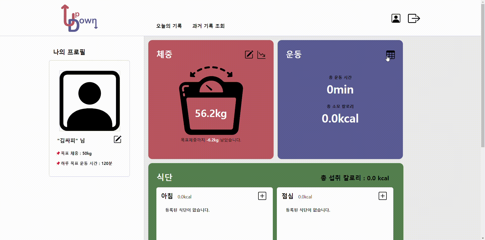

##### • 운동 등록 및 조회

- 검색 기능을 통해 운동 종류를 검색할 수 있다.(운동 csv 파일 활용)
  - 각 운동의 단위체중당 에너지 소비량을 보여준다.
- 검색을 통해 운동 종류를 선택하여 운동 시간을 입력하면, 사용자의 체중당 에너지 소비량을 계산해준다.
- 검색 기능을 사용하지 않고, 직접 등록할 수도 있다.
- 값을 입력하지 않으면 등록되지 않는다.


<br><br><br>


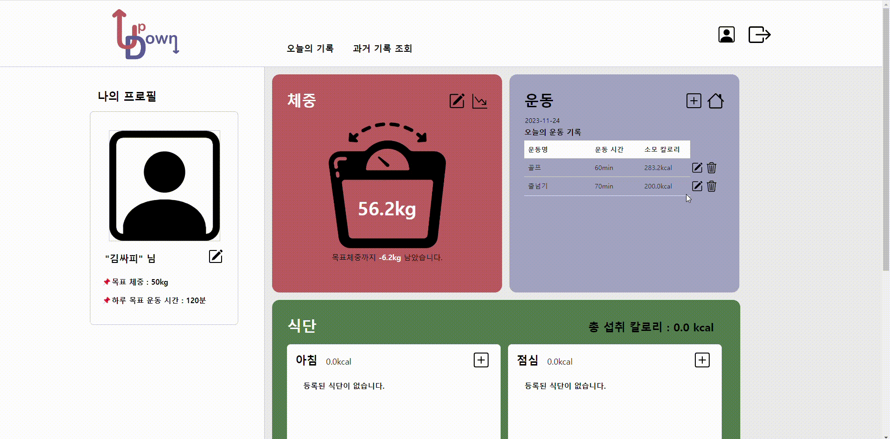

##### • 운동 수정

- 등록한 운동 기록을 수정할 수 있다.

 <br><br><br>


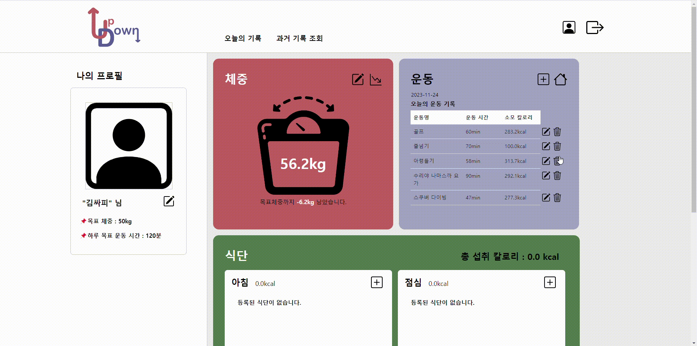

##### • 운동 삭제

- 등록한 운동 기록을 삭제할 수 있다.


<br><br><br>

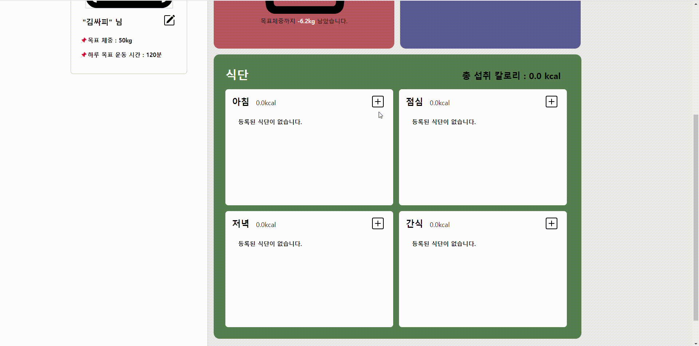

##### • 식단 등록 및 조회

- 검색 기능을 통해 음식을 검색할 수 있다.(영양 성분 api 활용)
  - 각 음식의 100g 당 열량을 보여준다.
- 검색을 통해 음식을 선택하여 섭취량을 입력하면, 음식 칼로리를 계산해준다.
- 검색 기능을 사용하지 않고, 직접 등록할 수도 있다.
- 값을 입력하지 않으면 등록되지 않는다.
- 사진 첨부도 가능하다.
- 등록 화면에서 첨부한 사진 미리보기가 가능하다.
- 가장 마지막에 첨부한 사진이 식단 목록에서 보여진다.
- 모든 식단의 총 칼로리를 보여준다.


<br><br><br>


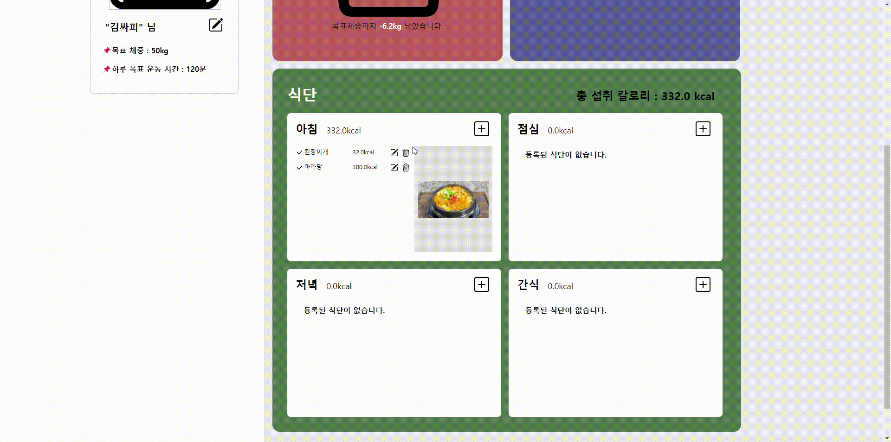

##### • 식단 수정

- 등록한 식단 기록을 수정할 수 있다.


<br><br><br>


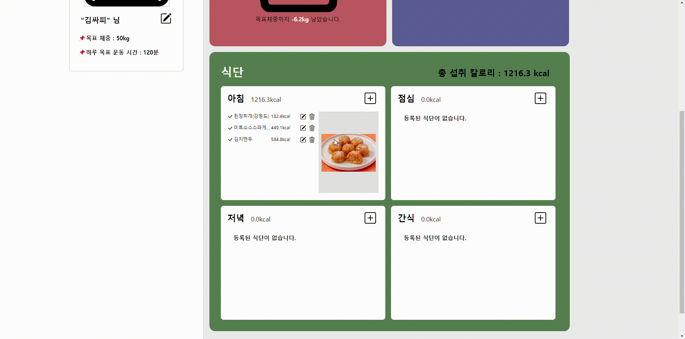

##### • 식단 삭제

- 등록한 식단 기록을 삭제할 수 있다.


<br><br><br>


##### • 과거 기록 조회

- 과거에 기록한 내용을 조회할 수 있다.(v-calender 활용)
- 선택한 날짜의 체중, 운동, 식단 기록을 한 눈에 볼 수 있다.


<br><br><br>

#### 🔹일반 기능

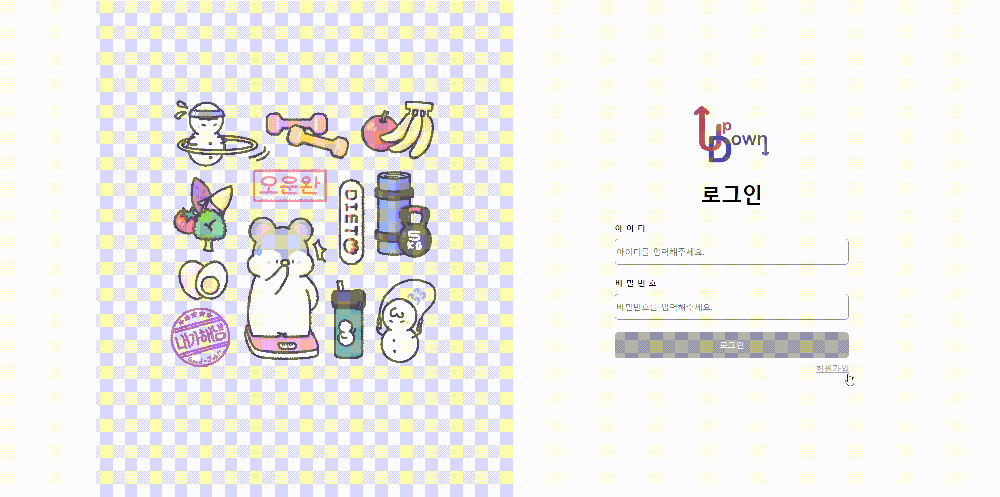

##### • 회원가입 및 로그인

- 아이디, 닉네임, 이메일이 중복되지 않으면 회원가입이 가능하다.
- 선택사항(프로필 사진)을 제외하고 모든 정보를 입력해야 회원가입이 가능하다.


<br><br><br>

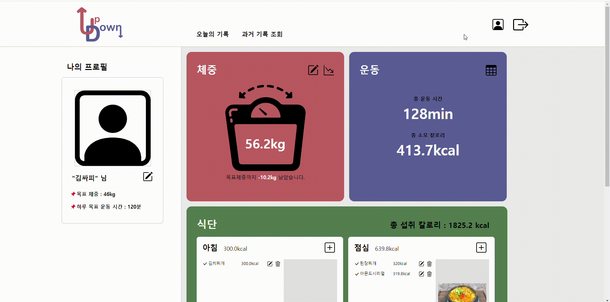

##### • 프로필 수정

- 사용자 정보를 수정할 수 있다.
- id를 제외한 모든 정보을 수정할 수 있다.

<br>

<br/>

---

## 🙋🏻‍♀️ 마무리

<br>

### 🔹어려웠던 점

- 화면 비동기 전환

  - 이번 프로젝트는 비동기 화면 전환이 아주 많아서 그것을 어떻게 구현해야 할지 무척 어려웠다. 맨 처음에 vue 틀을 잡을 때 했어야 하는 작업이라 팀원과 둘이 여러 방법을 찾아보았다. 

    방법은 `KeepAlive` 와 `shallowRef`를 사용 하는 것이었다.

    ```vue
    <template>
        <div class="container">
            <KeepAlive>
                <component :is="choose" :category="'아침'" :info="info" @regist="regist" @modify="modify" @getInfo="getInfo" @search="search" :diet="diet" @home="home"  @remove="remove" />
            </KeepAlive>
        </div>
    </template>
    
    <script setup>
    import { shallowRef, ref } from 'vue'
    import DietDetail from '@/components/diet/DietDetail.vue';
    import DietModify from './DietModify.vue';
    import DietUpload from './DietUpload.vue';
    import DietSearch from './DietSearch.vue';
    import { useDietStore } from '@/stores/diet';
    
    let choose = shallowRef(DietDetail);
    
        ...
        
    const regist = function() {
        choose.value = DietUpload;
    }
    
    const home = function() {
        choose.value = DietDetail;
        
        ...
    
    ```

    - `<KeepAlive>`는 Vue.js에서 제공하는 빌트인 컴포넌트로, 컴포넌트의 상태를 유지하면서 재사용할 수 있게 해준다. 

      `<KeepAlive>`를 사용하면, 컴포넌트 인스턴스가 처음 렌더링 될 때의 상태를 '캐시'하게 된다. 이후 같은 컴포넌트를 다시 렌더링할 때, 캐시된 상태를 이용하므로 컴포넌트의 초기화 과정을 생략하고 빠르게 화면에 표시할 수 있다. 또한, 컴포넌트의 상태도 유지되므로 사용자 경험을 높일 수 있다.

      (캐시(cache)란, 일반적으로 빠른 접근 속도를 목적으로 중복된 정보나 값을 임시로 저장해두는 공간을 의미한다)

    - `shallowRef`는 `ref`의 얕은 버전이다.

      `ref()`와 달리 `shallowRef()`의 내부 값은 있는 그대로 저장되고 노출되며 내부 깊숙이까지 반응형으로 동작하지는 않는다.

      각 컴포넌트의 내부 상태가 아닌, `choose`가 참조하는 컴포넌트 자체가 어떤 것인지에만 관심을 가지면 되므로 `shallowRef`를 사용하였다.

      

- 파일 업로드

  - 수업 시간에 배웠던 부분인데, 실제 프로젝트에 적용하려고 하니까 쉽지 않았다. 인터넷에 있는 자료들도 너무 다양해서 어떤 코드를 적용해야 하는지 알기 어려웠다. 수업 자료도 다시 공부하고, 여러 자료를 참고하며 내 프로젝트에 여러 코드를 적용해보았다. 시간이 꽤걸렸지만 많이 고민하고 노력한 덕에 다음 프로젝트에서 파일 업로드 부분은 자신있게 할 수 있을 것 같다. 자세한 방법은 위의 주요 코드 부분에 작성해 두었다.

    

- 새로고침 이슈

  - 새로고침을 해야 반영되는 이슈들을 많이 마주쳤다. 그중 하나는 식단 업로드 시에 사진을 같이 등록할 수 있는데, 예를 들어 첫 번째로 올린 식단에서는 사진을 첨부하지 않고, 두 번째로 올린 식단에서만 사진을 첨부했다고 가정해보자. 이 경우에 두 번째로 올린 식단을 삭제해도 두 번째 식단의 사진은 그대로 화면에 표시되었다. 새로고침을 해야만 그 사진이 사라졌다. 여러 방법을 찾아보다가 `watchEffect`를 사용하여 해결했다.

    - `watchEffect`를 사용하면, 식단 정보를 불러오는 동안에도 화면이 멈추지 않고, 새로운 식단 정보가 준비되는 즉시 화면이 업데이트된다.

      즉 `watchEffect`를 사용하면 새로고침 없이도 식단 정보의 변경을 감지하고 이에 반응하여 화면을 업데이트할 수 있다.


<br>

### 🔹배운 점

- 파일 업로드 하는 방법을 알게 되었다.
- 공공 데이터 api 활용 방법을 알게 되었다.
- `KeepAlive`를 사용하여 화면을 비동기로 전환하는 방법을 알게 되었다.
- `watch`만 사용해 보았는데, `watchEffect`에 대해서도 알게 되었다. 
- 설계 단계에서 주어진 기간동안 우리 팀이 얼마만큼을 해낼 수 있는지를 예상하고 계획을 세우는 것이 중요하다는 것을 알게 되었다.

<br>

### 🔹느낀 점

- 팀 프로젝트일수록 코드에 주석을 다는 것이 더욱 중요하다는 것을 느꼈다.

  - 개인 프로젝트인 경우에도 물론 주석을 다는 것은 중요하지만 팀 프로젝트에서는 더더욱 중요하다는 것을 느꼈다.

    오류를 마주했을 때, 주석이 없으면 시간이 배로 걸린다. 이번에 새로고침 이슈를 많이 마주했는데, 주석이 있었다면 좀 더 빨리 해결할 수 있었을 것 같다. 그리고 팀원과 코드를 공유하거나 설명해줄 때에도 주석이 있었다면 서로의 이해가 더욱 원활하게 이루어졌을 것 같다.

- 팀 프로젝트의 장점을 느꼈다.

  - 팀 프로젝트는 결국 하나의 결과물을 완성하는 것이 목표이며, 이 과정에서 팀원들 간의 협력이 중요하다. 팀원의 도움으로 더 나은 코드를 작성할 수 있었고, 더 배울 수 있는 기회가 된다는 것을 느껴서 성장한 기분이었다.

- 새로운 것을 시도하는 것이 의외로 어렵지 않을 수 있다는 것을 느꼈다.

  - v-calendar 라이브러리를 활용하여 과거기록 조회 기능을 구현하였다. 처음 사용해보는 것이라 조금 걱정했는데, 막상 사용해보니 어렵지 않게 원하는 기능을 구현할 수 있었다. 또한 처음으로 공공데이터 api를 활용하여 음식별 칼로리를 가져와보기도 했다. 이를 통해 새로운 것을 시도하는 것에 대한 두려움이 조금은 사라졌다.

<br>

### 🔹아쉬운 점

- 이번 프로젝트에서 구현한 웹사이트는 많은 기능이 있는 것이 아니기 때문에 화면이 다소 비어보이는 느낌이 있어서 아쉽다. 이 웹페이지를 모바일 어플리케이션으로 활용할 수 있는 방법에 대해 알아보고 한번 만들어 보아야겠다.

- 유저끼리 팔로우 할 수 있는 기능도 구현하고 싶었는데 시간이 부족해서 하지 못해 아쉽다.
